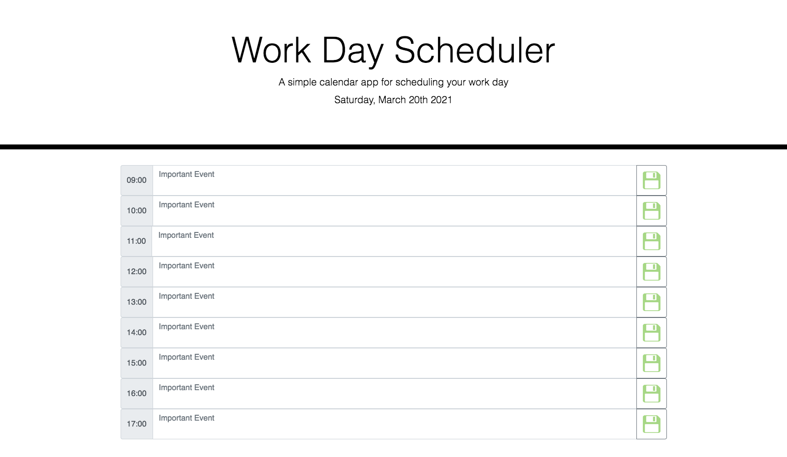

# HW-05 Work Day Scheduler

This project is an assigned homework for the Georgia Tech coding Bootcamp. The HTML, and CSS code were given. I worked on the Javascript code. 

This application emphasizes the use of Javascript, Jquery and Moment.js to dynamically updated HTML and CSS.

The user types the event into the desired time block and when he/she clicks on the saved icon, it will store the event in the localstorage.  

## Schedule Criterias 

  1. Current date must be display at the header of the page by using  Moment.js. 
  2. Each time block must have a saved button that stores the event in localstorage.
  3. Each saved event has to display after refreshing the page.
  4. Each time block is color coded by past, present and future events.

## User Story

```md
AS AN employee with a busy schedule
I WANT to add important events to a daily planner
SO THAT I can manage my time effectively
```
## Screen Shoot

The following is the screent shot of the application:



## Live links 

The following is the live link of the application:

    https://ndorado3.github.io/W05-MyDaily-Planner/

## Authors and acknowledment

- Nadia Dorado - student
- GT Bootcamp Project Design Team


